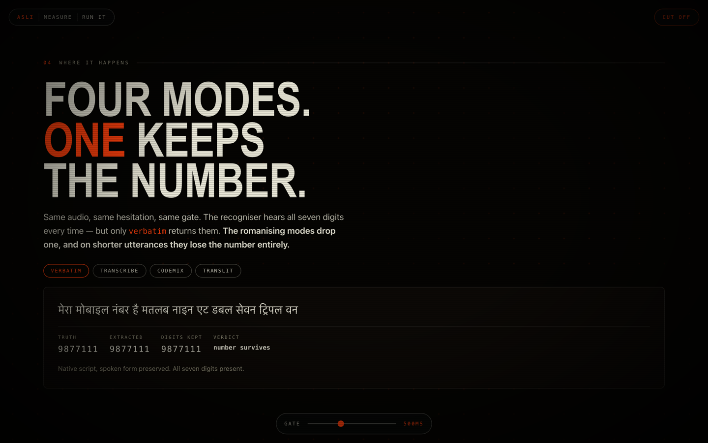
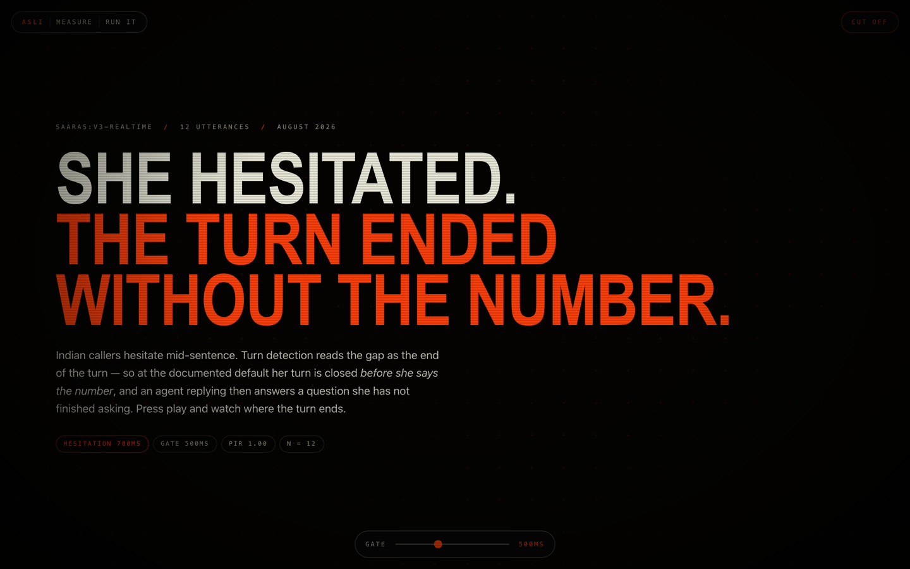
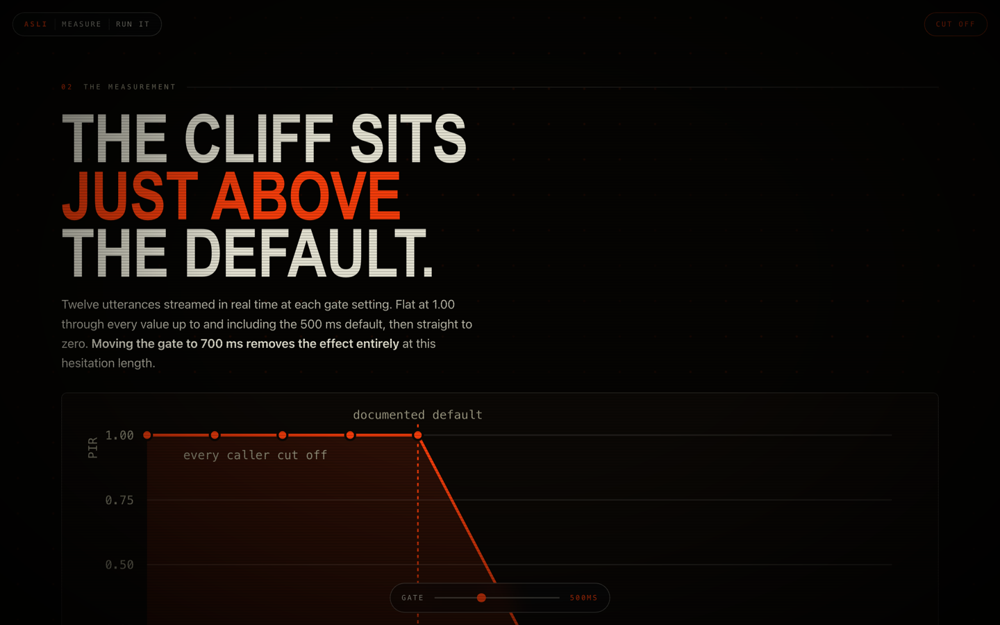
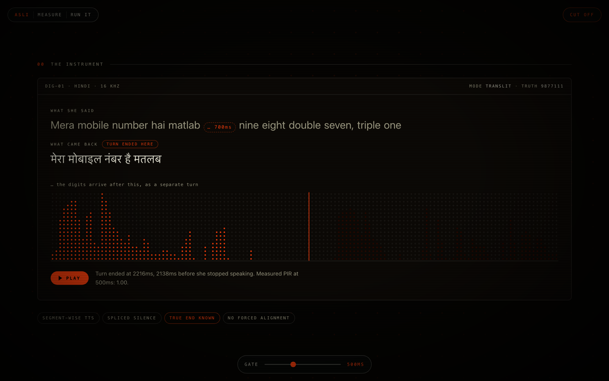
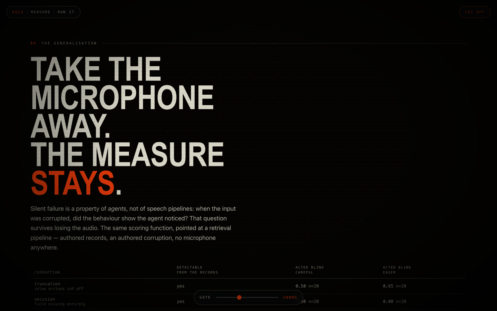
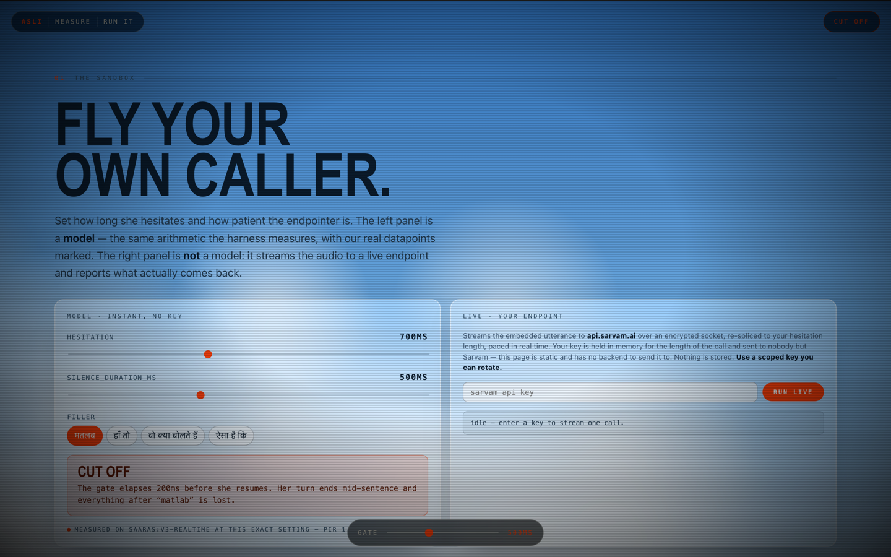

# asli

**Measure what an Indic voice agent *does* when things go wrong mid-conversation — not how accurately it transcribes.**

**Live demo:** https://riyadadlani02.github.io/asli/ · [mirror](https://asli-riya02.vercel.app)



---

## The finding, first

When you call a bank and say your account number, you might pause in the middle —
*"my number is, matlab…* (pause) *…nine eight double seven, triple one"*. Indian
speakers do this constantly. `matlab`, `haan toh`, `woh kya bolte hain` are the
verbal equivalent of "umm".

Put that filler immediately before the digits and the turn splits there. The
recogniser hears the whole thing — and in two of the four output modes **the digits
never arrive in the final transcript**:

```
[3917ms] transcript.partial   द रेफ़रेंस इज़ मतलब एट डबल ज़ीरो नाइन   ← all of it
[4022ms] transcript.final     The reference is Matlab                ← 8009 is gone
[4027ms] session.end          end_s 3.607, reported as covering the full turn
```

The partial has the number. The final, 105 ms later, does not — and nothing in the
session reports a truncation. That is one call, reproducible in one command
([step 3](#step-3--one-test-call)), and the mechanism is visible on the socket rather
than inferred from a score.

**How often is a caller in a position to hit this?** Measured on 5.02 hours of real
unscripted Hindi telephone speech, not assumed: **42.6% of 1,788 recordings carry a
mid-utterance hesitation long enough to end the turn early at the documented 500 ms
default** (17.9% of individual pauses). A caller only has to hesitate once.

**And when the turn does end early, what does the agent have?** Twelve live calls at
the default gate: the entity is in the transcript the agent holds at that moment in
**0%** of them, and in the full session transcript in 67%. The value is on the socket —
just not yet. [The conversation lane](#one-turn-is-not-a-conversation) is below.

The mode split, across 4 utterances × 2 runs with the filler before the entity —
the smallest sample here, and the direction is what to read, not the rate:

| mode | number survives | |
|---|---:|---|
| `verbatim` | **8/8** | native script, spoken form preserved |
| `transcribe` | 6/8 | native script |
| `translit` | **0/8** | romanised — entity dropped |
| `codemix` | **0/8** | romanised — entity dropped |

On the two shorter utterances the transcript simply ends at the filler, which is
scored as capitalised content (`Matlab`). This is the part that is a defect rather
than a setting, and it is [reproducible in one call](#step-3--one-test-call).

Two things it is **not**. Recognition itself was accurate throughout — the Hinglish,
the fillers, `1.25 lakh`, `ek karod pachas lakh`, `04032026` all came through. And the
endpointing gate below (`silence_duration_ms`) is a documented per-session setting
doing exactly what it is told; that its default sits just under a common hesitation
length is a tuning curve, not a bug.

## What else is measured




Voice agents decide you've finished talking by waiting for silence. If they wait
**500 milliseconds** and your "umm" pause lasts **700 milliseconds**, the agent
thinks you're done — and replies before you've said the number.

That's the other half of this. Not "did the microphone hear you correctly" (everyone
measures that), but "did the agent *behave* correctly when something went wrong".

Four things get measured. **Which lane each one runs on matters more than the number** —
only the first two are measured against a vendor endpoint at all:

| | in plain words | measured on |
|---|---|---|
| **PIR** | Did it cut the caller off mid-sentence? | the live endpoint, and real recordings |
| **recovery** | After the cut, did the value reach the agent — and was it talking over her? | the live endpoint |
| **INEPA** | Did it understand Indian number formats (`do lakh pachas hazaar` = ₹250,000)? | *our own* reference agent |
| **SFR** | When the input was damaged, did it check — or just act (`5677111` for `9877111`)? | *our own* reference agent, and a text pipeline |

INEPA and SFR say how a standard LLM agent handles Indian conventions and damaged
input. They are the harness proving its scorers can separate behaviours, not a
measurement of anybody's product. Read them as instrument validation.

**This is not a leaderboard.** No vendor is ranked. One system was characterised, in
public, with its own documentation open next to it.

---

## Try it in 60 seconds

No API keys, no accounts, no network. This proves the whole thing works on your machine.

```bash
git clone https://github.com/riyadadlani02/asli && cd asli
uv venv --python 3.12 && uv pip install -e .
python tests/test_asli.py
python tests/test_sfr_text.py
```

You should see:

```
  ok  test_dangling_rates_are_reported_over_the_cuts_only
  ok  test_dangling_separates_unfinished_endings_from_finished_ones
  ok  test_entity_survival_is_script_independent
  ok  test_fit_counts_only_the_clips_usable_as_a_real_caller
  ok  test_gate_advice_prices_the_latency_and_recommends_within_budget
  ok  test_indian_amounts_parse_as_lakh_and_crore
  ok  test_noise_lands_at_the_snr_we_asked_for
  ok  test_packet_loss_removes_roughly_the_share_requested
  ok  test_pause_detection_survives_a_real_noise_floor
  ok  test_pir_fires_only_when_the_gate_is_shorter_than_the_pause
  ok  test_pir_reports_the_word_the_turn_was_cut_on
  ok  test_real_audio_spec_locates_the_pause_and_bounds_its_own_error
  ok  test_recovery_separates_the_first_turn_view_from_the_session
  ok  test_render_timing_is_exact_by_construction
  ok  test_sfr_is_pinned_by_agents_with_known_behaviour
  ok  test_spoken_digits_binds_multipliers_to_the_following_digit
  ok  test_telephony_keeps_the_tone_and_drops_the_top_octave
  
  17 passed
```

Those seventeen checks are the harness proving its own scoring is correct — for example,
that a 256 ms endpointing gate *does* trip on a 700 ms hesitation and a 1024 ms one
*doesn't*. If the scoring can't be pinned, no measured number would mean anything.

Don't have `uv`? `curl -LsSf https://astral.sh/uv/install.sh | sh`, or use plain
`python -m venv .venv && pip install -e .`.

---

## Reproduce the headline result, step by step

The claim is: **at Sarvam's documented 500 ms default, all 12 test callers were cut
off mid-sentence.** Here's how to get that number yourself.

### Step 1 — get the two keys you need

| key | what it's for | where |
|---|---|---|
| `ELEVEN_API_KEY` | makes the caller's voice (text → speech) | elevenlabs.io |
| `SARVAM_API_KEY` | the agent being measured | dashboard.sarvam.ai |

Put them in a file called `.env` in the project folder:

```
ELEVEN_API_KEY=your_key_here
ELEVEN_VOICE_ID=your_voice_id_here
SARVAM_API_KEY=your_key_here
```

`.env` is git-ignored — it will not be committed.

**Only needed for the `--llm` examples further down** (the reference agent that parses
numbers). Those also need the extra: `uv pip install -e ".[agent]"`.

```
AZURE_OPENAI_API_KEY=...
AZURE_OPENAI_ENDPOINT=...
AZURE_OPENAI_DEPLOYMENT=...
AZURE_OPENAI_API_VERSION=2025-01-01-preview
```

The PIR reproduction below needs neither.

### Step 2 — make the audio

```bash
uv run asli demo
```

This writes 12 WAV files to `demo/wav/`. Expected output:

```
  dig-01-pir-700: true_end=4354ms  pauses=[(1716, 2416)]
  dig-02-pir-700: true_end=4731ms  pauses=[(2524, 3224)]
  dig-03-pir-700: true_end=3720ms  pauses=[(773, 1473)]

wrote 12 files to demo/wav/
```

Read that first line as: *this recording is 4354 ms long, and there is a deliberate
silent gap from 1716 ms to 2416 ms* — a 700 ms hesitation. **We know those numbers
exactly because we built the gap ourselves**, rather than recording someone and
guessing where they paused. That is the whole trick, and everything else depends on it.

Play `demo/wav/dig-01-pir-700-clean.wav` and you'll hear the pause.

### Step 3 — one test call

```bash
uv run asli check
```

```
  sending 4.4s of audio, paced in real time...

  transcript: 'मेरा मोबाइल नंबर है, मतलब। नाइन एट डबल सेवन ट्रिपल वन'
  events:     [('speech_start', 300), ('speech_end', 2400), ('transcript', 2400),
               ('speech_start', 2700), ('speech_end', 4355), ('transcript', 4355)]
  true_end:   4354ms   injected pause: [(1716, 2416)]

  PIR verdict: Interruption(premature=True, t_ms=2400, ms_early=1954, after_filler='matlab')
```

How to read it: `speech_end` at **2400 ms** is the agent deciding she's finished.
She actually finished at **4354 ms**. It ended her turn **1954 ms early** — right
inside the pause after `matlab`. That single call is the whole finding.

Do this before a sweep. It's one call and it tells you the key works.



*The same curve as Step 4 below, on the live demo. The dashed line is Sarvam's
documented default; everything left of it is "every caller cut off".*

### Step 4 — the sweep

```bash
uv run asli sweep --suite pir --agent sarvam --pause-ms 700
```

12 calls at each of 8 gate settings, streamed at real speed — **roughly 10 minutes**.

```
PIR vs silence_duration_ms  (agent=sarvam, pause=700ms, 16k clean, n=12)

    gate  silence_ms     PIR   in_pause  median_ms_early
     100         100     1.0        1.0             2434
     200         200     1.0        1.0             2620
     300         300     1.0        1.0             2520
     400         400     1.0        1.0             2420
     500         500     1.0     0.8333             2320
     700         700     0.0        0.0                -
     900         900     0.0        0.0                -
    1200        1200     0.0        0.0                -
```

`PIR 1.0` = all 12 callers cut off. `0.0` = none. The cliff is between 500 and 700.

### Step 5 — the same thing with no keys at all

```bash
uv run asli sweep --suite pir --pause-ms 700
```

Runs against the built-in mock recogniser. Same shape, no cost, no account. Useful
for checking the harness before spending credits.

---

## The three metrics, with examples

### PIR — premature interruption



*The hero panel on the demo site. The lit bars are her voice; the gap in the middle is
the 700 ms hesitation; the vertical line is where the agent decided she had finished.
The transcript underneath stops there.*


The endpointer waits `silence_duration_ms` of quiet before deciding the turn ended.
Set that shorter than the caller's hesitation and it fires mid-sentence.

| gate | hesitation | result |
|---|---|---|
| 500 ms | 700 ms | **cut off** — gate elapses 200 ms before she resumes |
| 700 ms | 700 ms | survives — she resumes exactly as the gate is met |
| 1200 ms | 700 ms | survives comfortably |
| 300 ms | 400 ms | **cut off** |

Verified against the live endpoint at 700 ms hesitation, and the cliff moves with
the hesitation: at a 400 ms pause it sits between 384 and 512 ms instead.

### INEPA — Indian number formats

These break parsers written for English conventions:

| spoken | means | why it breaks |
|---|---|---|
| `nine eight double seven, triple one` | `9877111` | "double"/"triple" multiply the **next** digit |
| `char zero double five six` | `40556` | `char` is Hindi for 4 |
| `do lakh pachas hazaar` | `250000` | lakh = 100,000 — its own scale, not thousands |
| `saade teen lakh` | `350000` | `saade` = "and a half", attaches **before** the scale |
| `ek crore pachas lakh` | `15000000` | crore = 10,000,000 |
| `one point two five lakh` | `125000` | decimal times a lakh |
| `pandrah tareekh, September` | 15 September | Hindi ordinal for the day |
| `2/1/2026` | 2 January | day-first, not month-first |

Try the parser directly:

```bash
uv run python -c "
from asli.score import normalise
print(normalise('amount', 'do lakh pachas hazaar rupaye'))   # 250000
print(normalise('amount', 'saade teen lakh'))                # 350000
print(normalise('digits', 'nine eight double seven triple one'))  # 9877111
print(normalise('digits', 'नाइन एट डबल सेवन ट्रिपल वन'))          # 9877111
print(normalise('date',   'It was on 2/1/2026.'))            # 2026-01-02
"
```

It reads Devanagari, roman, and already-converted digits as the same value — so a
recogniser answering in Hindi script isn't scored as an error.

### SFR — silent failure

The one that costs money. An entity was damaged; did the agent notice?

```
truth:      9877111
heard:      5677111            ← recogniser slipped
agent said: "Thanks, transferring to 5677111."     ← SILENT FAILURE
agent said: "I heard 5677111 — can you confirm?"   ← caught it
```

Reported two ways: `SFR_asr` (needs the transcript) and `SFR_bb` (black-box — works
against any agent, using only its final answer).

#### The same measure with no audio at all

SFR is a property of agents, not of speech pipelines: *when the input was corrupted,
did the behaviour show the agent noticed?* That question survives the removal of the
microphone. `asli text` asks it of a retrieval pipeline — authored records, an
authored corruption, no audio anywhere — and scores it through `score.sfr`, the same
function the voice side uses.

```bash
asli text --dry-run              # inspect the 113-item corpus, no API calls
asli text --stance eager         # needs the Azure keys
```

The corpus splits corruptions into ones detectable from the records (truncation,
contradiction, wrong scale, flipped date format, missing field) and one authored to be
undetectable — a single digit changed, still well-formed. The undetectable class is the
control: **if it scores the same as the detectable ones, SFR is reading confirm-rate
rather than error sensitivity.** It does not (0.25 vs 0.55), which is what makes the
rest of the number worth reading.



| corruption | detectable | careful | eager |
|---|---|---:|---:|
| truncation | yes | 0.50 | 0.65 |
| omission | yes | 0.00 | 0.00 |
| contradiction | yes | 0.15 | 0.35 |
| scale swap | yes | 0.43 | 0.57 |
| format flip | yes | 0.33 | 0.67 |
| **digit swap** | **no — the control** | **0.55** | **0.60** |

Stance separates in the same direction as the voice lane (0.25 careful vs 0.38 eager),
and the control sits above both — the metric is reading error sensitivity, not caution.

Full method, results, and two things that came out negative:
[docs/sfr-text.md](docs/sfr-text.md).

---

## One turn is not a conversation

Being cut off is the first half of the failure. She keeps talking — the number is still
coming — while the agent is already composing a reply to a question she had not
finished asking. Production agents mostly fail *after* the first mistake, and none of
that is visible in a single-utterance score.

It needs no new audio. A split turn produces two finals, and the harness already knows
the true end and the entity onset by construction, so three things fall out of
timestamps already in the stored rows:

```bash
uv run asli conv --agent sarvam --gate 500     # 12 live calls
uv run asli conv --agent sarvam --dry-run      # re-score the stored rows, no calls
```

| at the 500 ms default, n = 12 live calls | |
|---|---:|
| turns ended before she finished | **12/12** |
| entity present in the transcript the agent holds *at that moment* | **0%** |
| entity present in the full session transcript | 67% |
| agent audible while she is still saying the number, at 800 ms of its own lag | **100%** |
| silence the agent would need to hold to avoid talking over it (median) | **2,320 ms** |

The first two rows are the same calls scored two ways, and the gap between them is the
price of answering at end-of-turn: the value reaches the socket, just not yet. An agent
reading partials has it; one that acts when the endpointer fires does not.

The fourth row is why she then repeats herself into an agent that is talking. 800 ms is
a *generous* figure for LLM-first-token plus TTS-first-audio, and it is an input
(`--reply-latency-ms`), not a claim — and the row does not rest on it. The smallest
budget in the set is 1,249 ms, so any agent audible inside 1.25 s collides on all
twelve, and collision reaches zero only past 2.9 s. A slower stack collides *less*,
and trades the collision for dead air.

Three of the twelve sessions are scored **abstained** rather than failed: they are
spoken dates in Devanagari digit words, which this scorer cannot parse. Calling that a
vendor failure would be inventing a result, so the session row is a rate over what is
readable.

**Two bugs this lane found in the harness itself**, both now fixed and pinned by tests:
the amount parser absorbed number words from anywhere in the turn, so the filler
`ek minute` silently turned `do lakh pachas hazaar` into 1,201,000; and its scale words
were romanised-only, so a Devanagari `पच्चीस` was dropped — in a harness whose README
claims script independence. A metric that only ever sees one clean turn never exercises
either path.

---

## More results

### Only the romanising output modes lose the number

Same audio, same gate. **Control** puts the filler at the *start* of the sentence
where it precedes nothing; **hesitation** puts it immediately before the digits,
where a real speaker hesitates. n = 4 entities × 2 runs.

| mode | control | hesitation | verdict |
|---|---:|---:|---|
| `transcribe` | 6/8 | 6/8 | unaffected |
| `verbatim` | 6/8 | **8/8** | unaffected |
| `translit` | 4/8 | **0/8** | number lost |
| `codemix` | 6/8 | **0/8** | number lost |

Native-script output survives a hesitation. The romanising modes drop the entity
entirely. Example, `translit`:

```
"The reference is"  +  matlab  +  "eight, double zero, nine"
   →  final transcript: "The reference is Matlab"      ← 8009 is simply gone
```

### The recogniser heard it — the final transcript dropped it

Reading every message on the socket, with no early exit:

```
[ 1962ms] transcript.partial   द रेफ़रेंस इज़ मतलब
[ 3817ms] vad.speech_end
[ 3917ms] transcript.partial   द रेफ़रेंस इज़ मतलब एट डबल ज़ीरो नाइन   ← complete and correct
[ 4022ms] transcript.final     "The reference is Matlab"              ← digits removed
[ 4027ms] session.end          end_s 3.607 — claims to cover the whole turn
```

Recognition is right. The loss happens when the turn is finalised. **An agent
reading partials would have the number; one reading finals would not.**

### At the default gate the turn splits rather than truncating

Worth separating from the above, because they're different failures. At
`silence_duration_ms=500` the utterance becomes **two turns** — the digits do
arrive, in turn 2. The damage is that an agent replying at the first end-of-turn
answers a question she hadn't finished asking.

### Grounded in real speech: how often does this actually happen?

The 700 ms hesitation used above had to come from somewhere. It now does.

**Source:** [Gram Vaani Hindi](https://www.openslr.org/118/) (OpenSLR SLR118) development
set — 1,885 recordings, **5.02 hours of spontaneous Hindi telephone speech**, 8 kHz, from
a community voice platform in rural India. Unscripted callers on real phone lines: the
population this harness is about. Openly downloadable, free for academic use.

```bash
curl -O https://www.openslr.org/resources/118/GV_Dev_5h.tar.gz
tar xzf GV_Dev_5h.tar.gz
uv run asli fit --corpus GV_Dev_5h/Audio
```

48,631 silences measured across the 1,788 recordings with enough energy contrast to
separate speech from floor at all; 6,514 are pauses of ≥200 ms (below that they are
articulatory gaps between words, not hesitation — 200 ms is the conventional cut).

| | |
|---|---|
| median pause | **320 ms** |
| 75th percentile | 440 ms |
| 90th percentile | 640 ms |
| 99th percentile | 840 ms |
| lognormal fit | μ=5.843, σ=0.393, **KS=0.085** |

**The rate.** Share of real mid-utterance pauses long enough to end the turn early:

| gate | pauses that trip it |
|---:|---:|
| 300 ms | 55.3% |
| 400 ms | 30.0% |
| **500 ms (default)** | **17.9%** |
| 700 ms | 5.9% |
| 900 ms | 0.4% |

**About one mid-utterance pause in six is long enough to end the turn at the default
setting.** Moving the gate to 700 ms takes that to 1 in 17; to 900 ms, 1 in 250.

**The number a deployment actually feels is per *caller*, not per pause** — one
hesitation is enough to lose the turn. Share of recordings carrying at least one pause
that long, beside what raising the gate costs:

| `silence_duration_ms` | pauses tripped | callers affected | added turn-end latency |
|---:|---:|---:|---:|
| 300 | 55.3% | 84.7% | −200 ms |
| 400 | 30.0% | 62.2% | −100 ms |
| **500 (default)** | **17.9%** | **42.6%** | 0 |
| 700 | 5.9% | 17.3% | +200 ms |
| 900 | 0.4% | 1.3% | +400 ms |
| 1200 | 0.1% | 0.4% | +700 ms |

"Raise the gate" is not advice on its own: the gate elapses before the agent may
answer, so every millisecond added to it is added to every turn of every call. Both
columns, or it is a tuning curve rather than a recommendation.

```bash
uv run asli fit --corpus corpus/GV_Dev_5h/Audio    # prints the table and the pick
```

**Within +400 ms of added turn-end latency, `silence_duration_ms=900` is the setting:
callers carrying a long enough pause go from 42.6% to 1.3% — 97% of them removed.**
The latency budget is a product decision, so the harness takes it as an input
(`--budget-ms`) instead of assuming one: a booking bot can spend 400 ms, a
barge-in-heavy assistant cannot.

**This corrects an overstatement.** The 700 ms hesitation used in the sweep sits at the
**94th percentile** of real pauses — it is a long pause, not a typical one. A typical
320 ms pause does *not* trip the 500 ms gate. The earlier framing implied every caller
gets cut off; the measured rate is 17.9% of pauses, which is smaller and far more
defensible. It also means the sweep above should be read as *"when a caller does pause
this long, here is what happens"* — and the table here says how often that is.

Run the harness against realistic pauses instead of a fixed one:

```bash
uv run asli sweep --suite pir --agent sarvam --fitted
```

Caveats on this specific number: the pauses are *all* mid-utterance silences, not only
those following a filler like `matlab` — filler-conditioned timing needs word-aligned
transcripts, which is the next step. Gram Vaani callers are leaving voice messages
rather than talking to an agent, and a conversation may hesitate differently. KS=0.085
means the lognormal is a serviceable summary, not a tight fit — the percentile table
above is empirical and does not depend on it.

### Real callers, no synthesis anywhere in the path

The objection to every PIR number above is that the caller is a TTS voice, so the
acoustics *and* the placement of the hesitation are authored. PIR is the one metric that
does not need either: it needs the moment speech ended, and no known entity. So real
recordings can drive it directly.

Twenty Gram Vaani recordings that already carry a mid-utterance pause of ≥500 ms,
streamed as recorded at the default gate — plus a one-variable control in which only the
hesitation is replaced by digital silence.

```bash
uv run asli real --corpus corpus/GV_Dev_5h/Audio --agent sarvam --limit 20
uv run asli real --corpus corpus/GV_Dev_5h/Audio --agent sarvam --silence-pause
uv run asli real --corpus corpus/GV_Dev_5h/Audio --dry-run     # re-score, no calls
```

| condition | turn ended **inside a hesitation** | any early turn end | what changed |
|---|---:|---:|---|
| as recorded | **50%** (10/20) | 60% | nothing touched |
| hesitation replaced by digital silence | **70%** (14/20) | 80% | one variable: the pause floor |

**Ten of twenty real callers had a turn ended inside their own hesitation**, at the
documented default, with no synthesis in the path. These recordings were *selected* for
carrying a pause that long, so the rate is conditional on it; composed with the 42.6% of
recordings that do, it puts roughly **21% of this corpus's callers** — about 1 in 5 — in
the same position.

The control says how much of the escape is the line rather than the endpointer:
silencing the hesitation and changing nothing else takes it to 70%, **+20 points**. At a
median pause floor of −33 dB the live line's own noise protects some callers, but it is a
secondary effect and not the explanation. Two things follow: the exposed caller is the
one on a *quiet* handset, and noise suppression placed ahead of the VAD moves callers
toward the cut rather than away from it.

The second column — any early turn end — is reported for completeness only. A
spontaneous ten-second voice message *should* be split into several turns, so on this
corpus that number is close to free, which is exactly why the in-hesitation column is
the one to read.

**What this cost in rigour, stated rather than hidden.** `true_end_ms` is no longer known
by construction; it is measured by the same energy VAD that located the pause. In place
of a promise there are two bounds: a 20 ms analysis frame, and a per-recording spread
when the threshold is halved and doubled (20 ms median, 300 ms worst). The VAD takes the
last frame above threshold as the end, so a trailing quiet syllable makes an early cut
look *less* early — the error runs against the finding, as it does with the socket
latency. A hand-checked subsample to replace the sensitivity bound with a human one is
still owed.

**One correction this lane forced.** Attributing a cut to a pause was an exact window,
which mis-filed live cuts that arrived 40–100 ms after the pause closed — event times are
quantised to the 100 ms chunk they arrive on, so a one-chunk tolerance is now applied to
*attribution* only (never to whether a cut happened). On real audio it moved the
in-hesitation figure from 20% to 50%. The `in_pause` column in the stored
`pir_sweep_sarvam.json` predates it and is the stricter, lower number.

### Reference agent — INEPA and SFR

*These use our own fixed prompt in `agent.py`, not a vendor's agent.*

**INEPA 9/12 = 0.75**, identical across 5 repeat runs. All three failures are Indian
conventions on a *perfect* transcript:

| said | truth | agent returned |
|---|---|---|
| `char zero double five six` | `40556` | `000556` — didn't read `char` as 4 |
| `do lakh pachas hazaar rupaye` | `250000` | `350000` |
| `EMI saade sat hazaar hai` | `7500` | `17500` / `37500` / `75000`, varying per run |

**SFR separates two agent designs that WER scores identically:**

| stance | confirm rate | SFR_asr | SFR_bb |
|---|---:|---:|---:|
| `careful` | 1.00 | **0.00** (n=7) | 0.00 (n=6) |
| `eager` | 0.50 | **0.14** (n=7) | 0.17 (n=6) |

The careful agent scores 0.00 *because it confirms everything*, which is why the
confirm rate is printed beside it — a metric that can't move isn't measuring anything.

**One finding worth more than the score.** The prompt carries one line about *when to
confirm*. Deleting that line — touching nothing about parsing — makes
`do lakh pachas hazaar` parse **correctly** (250000 instead of 350000). An
instruction about confirmation behaviour moved numeric parsing. Anyone tuning an
agent prompt is moving both at once.

### What degradation does

The 8 kHz telephony codec alone changes PIR **not at all**. Babble at 5 dB SNR drives
it to 0.00 at every gate — not an improvement: the noise fills the pause so the
endpointer never fires and the turn never ends. The mirror failure.

---

## Try it in the browser

The demo site has a sandbox: set how long she hesitates and how patient the
endpointer is, and see whether she gets cut off. The left panel is a model and says
so; the right panel streams the audio to a real endpoint with your own key and
reports what actually came back.



*When your settings match a datapoint we actually measured, it says so —
"measured on saaras:v3-realtime at this exact setting". Otherwise it is labelled
as modelled.*


---

## Examples you can copy

### Add your own test phrase

Edit `entities.yaml`:

```yaml
- id: my-01
  entity_type: digits          # digits | amount | date
  canonical: "40556"           # the truth — what SHOULD be understood
  lang: hi-IN
  segments:
    - text: "Account ke last five digits"
    - text: "char zero double five six"     # the entity goes in the LAST segment
```

Then `uv run asli run --suite inepa --llm`. The hesitation is spliced in
automatically before the final segment.

### Change how long she hesitates

```bash
uv run asli sweep --suite pir --agent sarvam --pause-ms 400    # shorter pause
uv run asli sweep --suite pir --agent sarvam --pause-ms 1000   # longer pause
```

The cliff moves with it — that correspondence is the method checking itself.

### Add a bad phone line

```bash
uv run asli run --suite inepa --telephony              # 8 kHz G.711
uv run asli run --suite inepa --snr 5 --noise babble   # call-centre floor
uv run asli run --suite inepa --telephony --snr 5 --noise babble
```

### Test your own agent

One method. That's the whole interface:

```python
from asli.spec import CallSpec, Event, Result
import numpy as np

class MyAgent:
    name = "mine"

    def run(self, pcm: np.ndarray, spec: CallSpec) -> Result:
        # pcm is int16 mono @16kHz. Send it to your agent however you like.
        # Then report what happened, timestamped from the start of the audio:
        return Result(
            spec_id=spec.id, adapter=self.name,
            events=[
                Event("speech_start", 300),
                Event("speech_end", 2400),        # when YOUR agent decided she stopped
                Event("transcript", 2400, "what your agent heard"),
            ],
            transcript="what your agent heard",
            agent_entity="9877111",   # what it finally understood
            confirmed=True,           # did it read the value back?
        )
```

PIR compares your `speech_end` against `spec.true_end_ms`. Everything else follows.

### Read a result row

Every call writes one line to `results/*.jsonl`:

```
spec.id        dig-01
spec.canonical 9877111          ← the truth
true_end_ms    3027             ← when she actually stopped
transcript     "Mera mobile number hai nine eight double seven, trip…"
agent_entity   9877111          ← what the agent concluded
confirmed      True             ← did it read it back?
events         [('speech_start',0), ('speech_end',3027), ('transcript',3027)]
```

That file *is* the artefact — every number in this README is computed from it.

---

## Read this before citing any number

- **Two lanes, and only one is a vendor.** Live results are `saaras:v3-realtime`.
  Everything under *Reference agent* uses the bundled `MockASR`, an energy-gated VAD
  that exists to calibrate the scorers and run CI for free. It is an *instrument*,
  not a system under test — its noise collapse is a property of fixed-threshold
  energy gating that a probability-based VAD should not share. The two lanes are not
  comparable.
- **The gate is a documented setting, not a defect.** `silence_duration_ms` is a
  per-session parameter and the endpointer does exactly what it's told. The finding
  is that the default sits just below a common hesitation length.
- **n = 12.** A proving run, not a rate. Don't quote a percentage off it.
- **The hesitation lengths are now grounded, the caller still is not.** Pause lengths
  come from 5 hours of real spontaneous Hindi telephone speech (above), so the *timing*
  is no longer arbitrary. The utterances themselves are still TTS, so the acoustics and
  the placement of hesitation within a sentence remain synthetic. **What closes it is
  in the repo already** — see below.
- **The pause distribution is all mid-utterance silences**, not specifically those after
  a filler. Filler-conditioned timing needs word-aligned transcripts.
- **PIR is conservative.** Event times are taken as *audio sent so far*, so network
  latency inflates the apparent endpoint time. That pushes results away from
  "premature", never toward it.
- **INEPA measures the reference agent**, which is ours. It says how a standard LLM
  agent handles Indian numeral conventions, not how anyone's parser does.
- **The reference LLM is not deterministic** even at `temperature=0`: `saade sat
  hazaar` returned `17500`, `37500` and `75000` across runs. The 0.75 aggregate was
  stable over 5 runs; individual values were not.
- **The conversation lane's collision row is parameterised, not measured.** 800 ms of
  agent lag is an input (`--reply-latency-ms`); the harness measures the *budget* — how
  long the agent would have to stay silent — and the collision follows from the two. The
  result is insensitive to that input: the smallest budget in the set is 1,249 ms, so
  every lag under 1.25 s yields the same 12/12, and collision reaches zero only past
  2.9 s. A slower stack collides *less*, and holds dead air instead.
- **Three of the twelve conversation sessions abstain** rather than fail: spoken dates
  in Devanagari digit words, which this scorer cannot parse. The session-transcript row
  is a rate over what is readable, and the abstention count is printed beside it.
- **On the real-caller lane `true_end_ms` is measured, not built.** Energy VAD, 20 ms
  frames, with the per-recording spread under a halved and doubled threshold reported
  next to the result. The VAD takes the last frame above threshold as the end, so a
  trailing quiet syllable makes an early cut look *less* early.
- **The real-caller sample is selected for containing a ≥500 ms pause**, so its cut rate
  is conditional on that and is *not* the population rate. Composing it with the share
  of recordings that carry such a pause is what gives a population figure, and that
  composition assumes the two are independent.
- **A cut is attributed to a pause with a 100 ms tolerance** — one audio chunk, because
  event times are quantised to the chunk on which they arrive. It changes which pause a
  cut belongs to, never whether one happened. The `in_pause` column of the stored
  `pir_sweep_sarvam.json` predates this and is the stricter, lower figure.
- **The mode result is n = 4 entities × 2 runs** at one gate. The direction is
  consistent and the mechanism is visible in the socket trace, but it wants the full
  bank before it's a rate.

### The synthetic-caller gap, and what is left of it

It is closed for PIR — see [Real callers](#real-callers-no-synthesis-anywhere-in-the-path)
above: 20 unscripted recordings streamed unmodified, with the true end measured and its
error bounded instead of promised. 813 of the 1,885 corpus recordings carry a ≥500 ms
mid-utterance pause, so 793 usable ones remain unrun.

```bash
uv run asli fit  --corpus corpus/GV_Dev_5h/Audio   # writes results/pause_fit.json
uv run asli real --corpus corpus/GV_Dev_5h/Audio --agent sarvam --limit 20
```

What it does **not** close, and cannot: INEPA and SFR need a known entity inside the
utterance to score against, and spontaneous corpus speech does not contain one. Those
lanes stay authored, and that is structural rather than a to-do.

## How it works

Nine pieces. One JSONL row per call in `results/`.

```
asli/
  spec.py     ground-truth record        drive.py    adapters (MockASR, SarvamWS)
  synth.py    segment-wise TTS + splice  score.py    inepa() pir() sfr() recovery()
  degrade.py  8k μ-law, noise, loss      agent.py    reference agent (two stances)
  fit.py      pause distribution + gate  real.py     real recordings -> CallSpec
  text/       the same SFR, no audio     cli.py      the commands
```

Every lane goes through `score.py`, and `real.py` earns its place by making a real
recording describable as a `CallSpec` — which is why `pir()` scores real audio without
a line of change.

The one non-obvious decision is in `synth.py`. **Each segment is synthesised as its
own TTS call and the pauses are spliced in by us as exact silence** — never one call
for a whole disfluent sentence with alignment afterwards. Every boundary, including
the true end of the utterance, is then known by construction, and PIR is a comparison
of two timestamps instead of an audio-onset estimation problem.

TTS output is trimmed before splicing, because the engine pads each clip with its own
silence — and that padding would otherwise lengthen the gap and quietly falsify every
timing claim in the harness.

## Roadmap

1. ~~INEPA end to end~~ — done.
2. ~~Degradation layer + SFR~~ — done. Still owed: an LLM confirmation classifier with
   Cohen's κ against ~200 hand-labelled turns.
3. ~~Fit the hesitations to real speech~~ — done, on 5.02 h of spontaneous Hindi
   telephone speech (Gram Vaani / OpenSLR SLR118). PIR is now a rate: **17.9% of real
   mid-utterance pauses exceed the 500 ms default.** Owed next: filler-conditioned
   timing, which needs word-aligned transcripts.
4. ~~Run the live lane~~ — done. Owed: the mode/placement probe across the whole
   entity bank rather than four entities.
5. ~~SFR outside speech~~ — done. The measure discriminates agent stances in a text
   retrieval pipeline too, and the detectability control holds. Two negatives worth
   the same billing: the stance gap is 0.137, not the ≥0.3 predicted before the run,
   and the prompt-entanglement effect seen in voice did not replicate at all.
6. ~~Real-caller PIR~~ — done. Real unscripted telephone recordings streamed unmodified,
   true end from the VAD with a threshold-sensitivity bound instead of a promise. Owed:
   a hand-checked subsample to replace the sensitivity bound with a human one, and the
   remaining 793 usable recordings rather than 20.
7. ~~The rest of the call~~ — done. `asli conv` scores what the agent holds when it
   answers, against what the session eventually contains, and whether it is audible over
   the entity. Owed: a real barge-in lane — the caller's remaining speech streamed *into*
   an agent that is already speaking, which needs a duplex adapter rather than a
   one-shot one.
8. ~~What to set the gate to~~ — done. `asli fit` prints the interruption/latency
   trade-off per gate and picks within a stated latency budget. Owed: the same
   trade-off measured end-to-end rather than derived, which needs a full agent in the
   loop.

## The site

`site/index.html` is a standalone single-file page — audio, waveforms and every number
embedded, no build step, no external requests.

```bash
python3 -m http.server --directory site 8000    # view locally
python3 build_site.py                           # rebuild after a new run
```

`build_site.py` writes **both** `site/index.html` and `docs/index.html`. GitHub Pages
serves `docs/` from the `main` branch, so **commit `docs/` or the live page won't
change**. (Pages serves the branch folder rather than building in CI, because Actions
is unavailable on this account.)

## Who

Built by [riyadadlani02](https://github.com/riyadadlani02). Corrections are the point:
if a number here is wrong, [open an issue](https://github.com/riyadadlani02/asli/issues)
and it gets fixed in the README and on the site together, because both are generated from
the same stored rows.

Adapters for other systems are one method (`run(pcm, spec) -> Result`) — see
[Test your own agent](#test-your-own-agent). A PR adding one is welcome.

## Licence

MIT.
